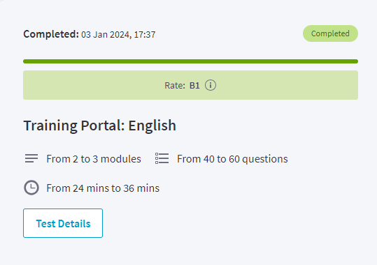

# Sazonko Tatyana 

 

### *Junior Frontend Developer*
---

#### My Contacts

**Phone:** +38 (097) 79 27 605
**Location:** Dnipro, Ukraine
**Email:** sazonko.tatyana@gmail.com
**LinkedIn:** [My LinkedIn](https://www.linkedin.com/in/tatyana-valchuk-19701a192/)
**GitHub:** [tatyanka-study](https://github.com/tatyanka-study)
**Discord:**[Tatyana](https://discordapp.com/users/tatyana_84061)


### About Me
My main education is an Economist. I work as a leading economist in a large department. Since 2016, I have been studying part-time and working freelance as a front-end developer and for 7 months I was engaged in advertising on Google, Facebook and Instagram. I love when work requires and promotes the development of professional and personal skills.


### Skills

- HTML5 + Emmet
- CSS3, CSS Grid, CSS Flex, LESS
- jQuery, Bootstrap
- CMS: WordPress, Tilda, Joomla
- JavaScript + DOM
- React
- Git, GitHub
- Photoshop, Figma
- SEO
- Google Ads, Google analytics
- Facebook, Instagram advertising


---
### Code example

_**Exercise:**_
Write a script for "Guess the Number Game":
1. The essence of the game is to guess the number predicted by the script in fewer attempts.
2. Every time the player tries to guess a number, the script displays a hint - the script guessed a smaller or larger number.
3. The script guesses the number only once at the beginning of the game and this number does not change until the end of the game.

```
<body>
    <div class="input-panel">
        <input type="text" id="task-name-input">
        <button id="add-task-btn">Add new task</button>
    </div>

    <div class="task-list">
        <p id="start-message">Нет новых задач</p>
    </div>

    <template id="template">
        <div class="task">
            <input type="checkbox">
            <p>{{.}}</p>
        </div>
    </template>

    <script src="mustache.min.js"></script>

    <script>       
        let taskNameInput = document.querySelector("#task-name-input");
        let addTaskButton = document.querySelector("#add-task-btn");
        let startMessage = document.querySelector("#start-message");
        let taskList = document.querySelector(".task-list");

        addTaskButton.addEventListener("click", addTaskHandler);
        taskList.addEventListener("click", changeTaskState);

        function createTask(text) {
            let template = document.querySelector("#template").innerHTML;
           
            let newElement = Mustache.render(template, taskNameInput.value);            
            taskList.innerHTML +=newElement;           
        }

        function changeTaskState(e) {
            if (e.target.nodeName != "input" && e.target.type != "checkbox") {
                return;
            }

            if (e.target.checked) {
                e.target.parentElement.classList.add("completed");
            } else {
                e.target.parentElement.classList.remove("completed");
            }
        }

        function addTaskHandler() {
            if (taskNameInput.value) {
                if (!startMessage.hidden) startMessage.hidden = true;

              createTask(taskNameInput.value);
                //taskList.append(newTask);
                taskNameInput.value = "";
            } else {
                alert("введите имя задачи");
            }
        }
    </script>
</body>
```
---

### Professional Experience
- 2022 - 2023
   - several small applications when I was taking a Frontend course
- 2021
   - Facebook, Instagram advertising (freelance)
- 2016 – 2020
   - Creating sites (freelance)
   - Writing and creating sites on CMS, taking into account SEO requirements
- 2010 – 2011
   - Copywriting (freelance)
- 2010 – 2024
   - Economist

---

### Education
- **2024** 
      * RS School Course - _JS/FE Pre-School 2024Q2_
- **2022** 
      * During 2022, to update and deepen my previous knowledge, I passed Frontend course
- **2021** 
      * Different advertising courses
- **2020** 
      * DPRO FREE WORK - _сreating sites on CMS Tilda_
- **2016 - 2017** 
      * Computer Academy STEP -  _сreating and promotion of Web Projects_
- **2005-2010** 
      * Dnepropetrovsk National University named after O. Gonchar -  _specialty accounting and audit_
---

### Languages
1. English - Level B1

2. Ukrainian - native
3. Russian - proficiency